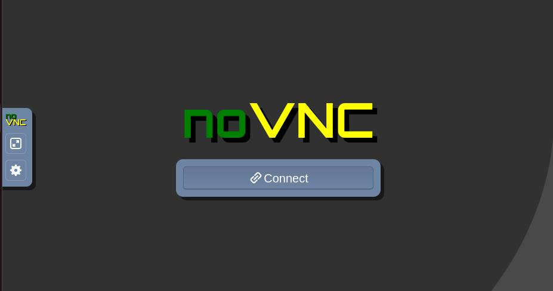
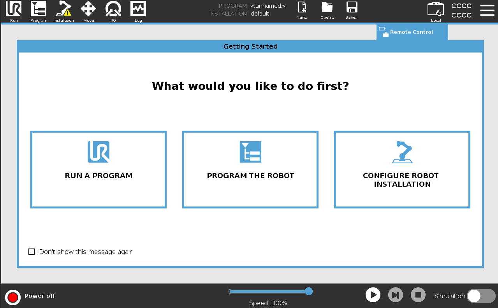

# Simulators

An AICA application consists of various components and controllers that execute a specific behavior or a sequence of 
behaviors. These behaviors can quickly become complex, making it challenging to evaluate their safety and functionality
 without real hardware. Simulators offer an ideal solution for this issue. They can emulate the physics affecting the 
 robot and demonstrate the behavior of an AICA application without the need to connect to actual robots.

In this repository, we provide several simulator options that enable users to visualize the behavior of the robot while 
running an AICA application. These include the official UR Simulator, available in a Docker image, and the MuJoCo Simulator.

The UR Simulator is the official tool provided by Universal Robots for simulating their robots. It closely mimics the 
actual pendant used by UR, providing a realistic experience that closely replicates how a user would interact with the 
actual robot. 

MuJoCo is a free and open-source physics engine that simulates the dynamics of a robot. MuJoCo simulator is more general 
compared to UR Simulator as it is not related to one robot brand.


# How to connect to a simulator

Connecting to a simulator in an AICA application is extremely straightforward. In AICA Studio, users can select a URDF 
for a specific simulator. For example, as shown in the image below, users can choose the corresponding URDF from the 
dropdown menu. This selection is related to a specific hardware driver, which also includes the simulator driver.


This makes it extremely easy for the user to switch between a simulated robot driver and an actual robot driver.

# How to run URSIM

To run URSIM, follow these steps:

1. Clone this repository.
2. Navigate to the `ursim` folder.
3. Execute the following command:

```sh
./run.sh
```

That script will install and run the URSIM Docker container, and you should see a similar output in your terminal:

```
IP address of the simulator

     192.168.56.101
```

Access the robot's user interface through this URL:

```
http://192.168.56.101:6080/vnc.html?host=192.168.56.101&port=6080
```

By following that URL, you will be able to see the following page:



Once you are on the homepage, you need to enable the Remote Control mode in the settings page first. 

Continue by clicking "Connect" and then navigate to the settings page by clicking the burger icon in the top left corner
of the screen.

Click on the "System" tab, then select the "Remote Control" tab.


Then click "Enable" and then "Exit" at the bottom left of the screen.


A touchpad icon labeled "Local" should appear in the top right corner of your simulator. Click on this icon and then
select "Remote Control."



After setting the robot to Remote Control mode, turn the robot on by pressing the red button located in the bottom left
corner of the screen.

This will take you to the following page. Press "ON" followed by "START" to activate your simulated robot.


Then press "EXIT." The simulator is now ready to interface with an AICA application.

In AICA Studio, open the Hardware section and select validate that your URDF have the following plugin and ensure that 
the IP address in the `robot_ip` field matches the IP address displayed in your terminal.


```
<hardware>
    <plugin>robot_interface/universal_robots/UniversalRobotsInterface</plugin>
    <param name="robot_ip">192.168.56.101</param>
    <param name="speed_timeout">0.002</param>
    <param name="acceleration_limit">1.0</param>
</hardware>
```