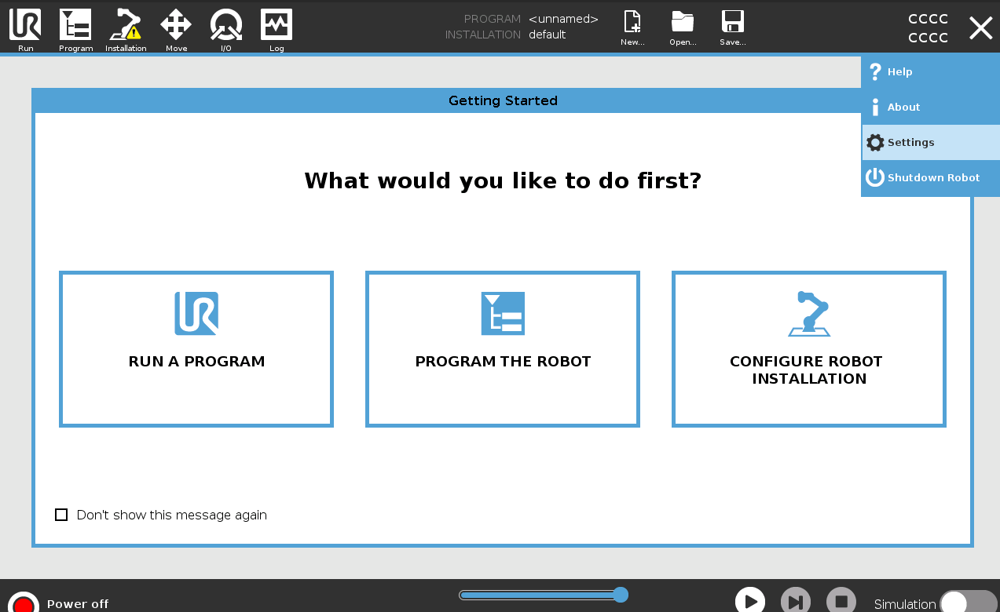
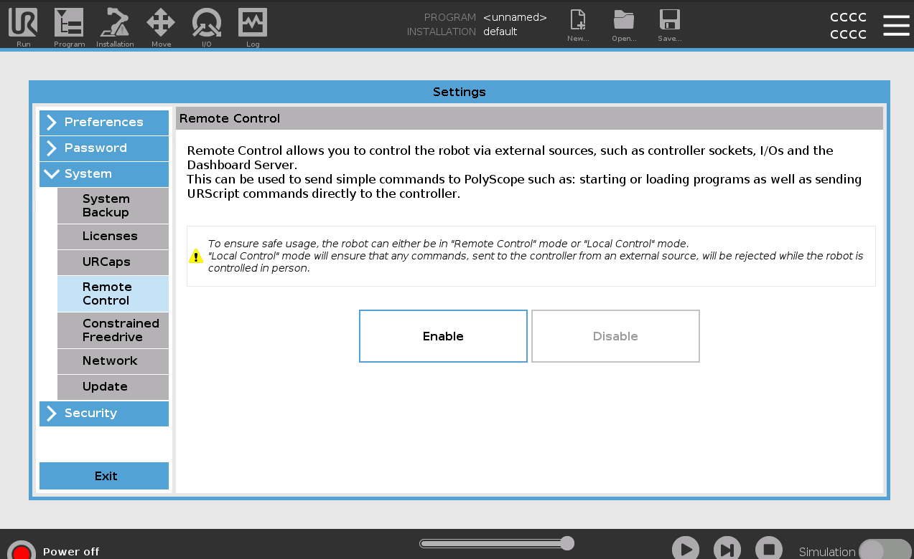
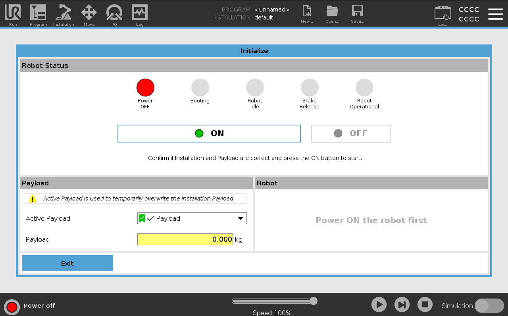
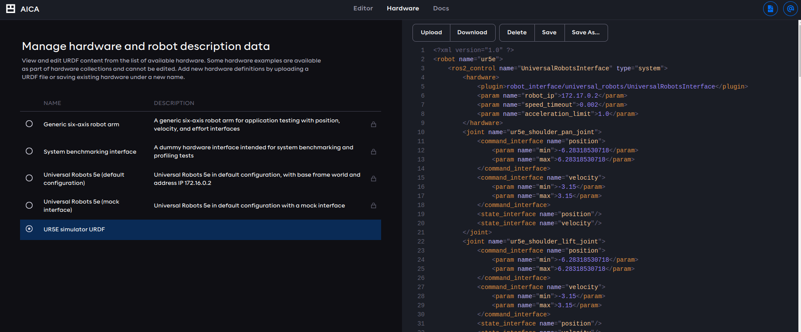

# How to run URSIM

To run URSIM, follow these steps:

1. Clone this repository.
2. Navigate to the `ursim` folder.
3. Execute the following command in this folder:

```sh
./run.sh
```

This will use the UR5e robot model by default. To simulate a different robot model, use the `-m` flag followed by a
model specifier. For example, to simulate the UR10e, run the following command:

```sh
./run.sh -m ur10e
```

Supported robot model specifiers are: `[ur3, ur3e, ur5, ur5e, ur10, ur10e, ur16e, ur20, ur30]`

The script will install and run the URSIM Docker container, and you should see a similar output in your terminal:

```
IP address of the simulator

     192.168.56.101
```

Access the robot's user interface through this URL:

```
http://192.168.56.101:6080/vnc.html?host=192.168.56.101&port=6080
```

By following that URL, you will be able to see the following page:


Once you are on the homepage, you need to enable the Remote Control mode in the settings page first.

Continue by clicking "Connect" and then navigate to the settings page by clicking the burger icon in the top left corner
of the screen.

Click on the "System" tab, then select the "Remote Control" tab.



Then click "Enable" and then "Exit" at the bottom left of the screen.



A touchpad icon labeled "Local" should appear in the top right corner of your simulator. Click on this icon and then
select "Remote Control."


After setting the robot to Remote Control mode, turn the robot on by pressing the red button located in the bottom left
corner of the screen.

This will take you to the following page. Press "ON" followed by "START" to activate your simulated robot.



Then press "EXIT." The simulator is now ready to interface with an AICA application.

### Configure the IP address of the robot in AICA Studio

In AICA Studio, open the Hardware section and validate that your URDF has the following plugin and ensure that
the IP address in the `robot_ip` field matches the IP address displayed in your terminal.



```
<hardware>
    <plugin>robot_interface/universal_robots/UniversalRobotsInterface</plugin>
    <param name="robot_ip">192.168.56.101</param>
    <param name="speed_timeout">0.002</param>
    <param name="acceleration_limit">1.0</param>
</hardware>
```